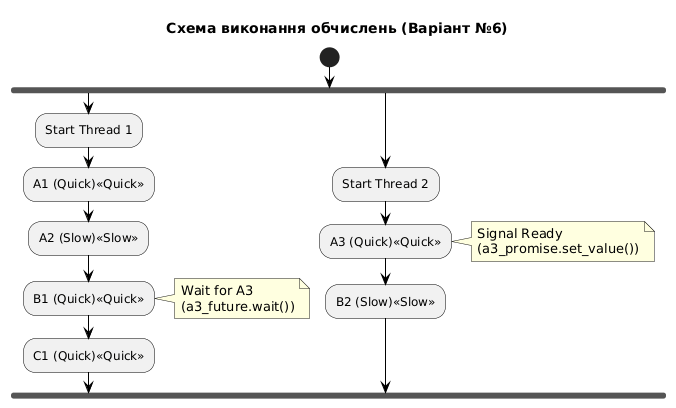

# lab 5

Цей проєкт демонструє використання асинхронного програмування в C++ для моделювання залежних обчислювальних процесів. Програма реалізує оптимальну схему виконання завдань з використанням `std::future`, `std::async` та `std::promise`.

##  Опис завдання (Варіант №6)

Необхідно виконати набір обчислень із заданими часовими затримками та залежностями.

**Вхідні дані:**
* **Всі обчислення:** A1, A2, A3, B1, B2, C1, C2
* **"Повільні" обчислення (7 с):** A2, B2
* **"Швидкі" обчислення (1 с):** всі інші
* **Залежності:**
    * `B1` залежить від `A1` та `A2`
    * `C1` залежить від `B1` та `A3`
    * `C2` залежить від `B2`

### 🛠 Реалізація
Програма мінімізує кількість запусків потоків, об'єднуючи залежні завдання у два основні ланцюжки виконання з синхронізацією через `std::promise`.

**Схема виконання:**

